# Schedex (Sigslot) — Intelligent Appointment Scheduling Platform

🌐 **Live Demo**: [https://gen-ai-capstone.onrender.com](https://gen-ai-capstone.onrender.com)

A scalable, secure, and production-ready full-stack appointment scheduling platform that unifies service provider discovery, appointment lifecycle management, AI-powered document verification, a RAG chatbot, waitlist management, payment processing, and Excel report generation — designed for a four-tier actor model (Admin, Customer, Service Provider, Organization).

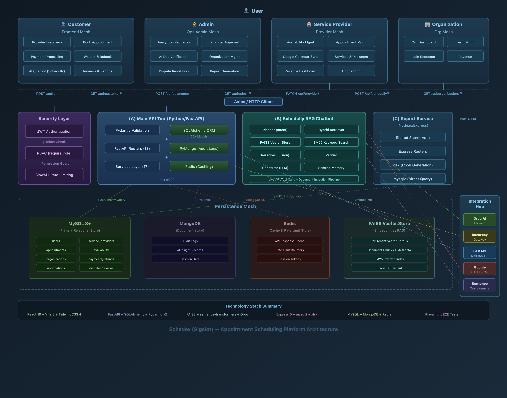

---

## 🌟 Features

### User Authentication & Role Management
- 🔐 **Multi-Role Login** — Dedicated login flows for Admin, Customer, Provider, and Organization with role-aware routing
- 🔑 **Google OAuth 2.0** — One-click Google sign-in via `@react-oauth/google` and `google-auth` backend strategy
- 📧 **OTP Verification** — Email-based OTP verification for account activation via FastAPI-Mail
- 🔄 **Forgot & Reset Password** — Secure OTP-based password recovery flow
- 🛡️ **Role-Based Access Control (RBAC)** — Dependency-injected role guards across all Admin, Customer, Provider, and Organization routes
- 🔒 **JWT Authentication** — Stateless token-based auth via httpOnly cookies + Bearer headers on all protected endpoints
- 🗑️ **Soft Delete & Restore** — Accounts can be deactivated and later restored with full data recovery
- 👮 **Admin 2FA** — Admin login requires additional OTP verification step


---

### Admin — Dashboard
- 📈 **Aggregated KPIs** — Total appointments, active providers, revenue, pending approvals at a glance
- 📋 **Recent Activity Feed** — Live snapshot of latest appointment activity across the platform
- 👥 **Provider Fleet Summary** — Quick view of verified vs pending providers in the system
- 📊 **Analytics Charts** — Recharts-powered visual breakdowns of appointment volumes and status distribution

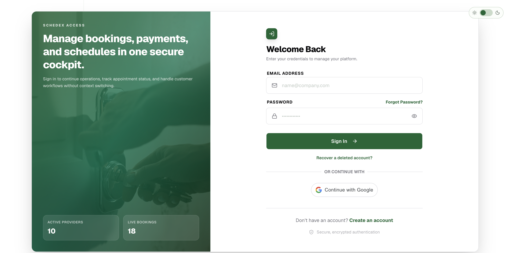

---

### Admin — Provider Approval & AI Verification
- ✅ **Approval Workflow** — Review, approve, or reject provider onboarding applications
- 🤖 **AI Document Verification** — Groq LLM (Llama 3) validates uploaded certificates against category-specific requirements
- 🎯 **Category-Aware Validation** — Healthcare, Beauty & Wellness, Business Consulting, Education, Home Services, Fitness — each with unique keyword checks
- 🔍 **Risk Assessment** — AI-generated risk levels (low/medium/high) with summary highlights for admin review
- 📄 **Identity Proof Validation** — Aadhaar, Passport, Driving License, Voter ID detection

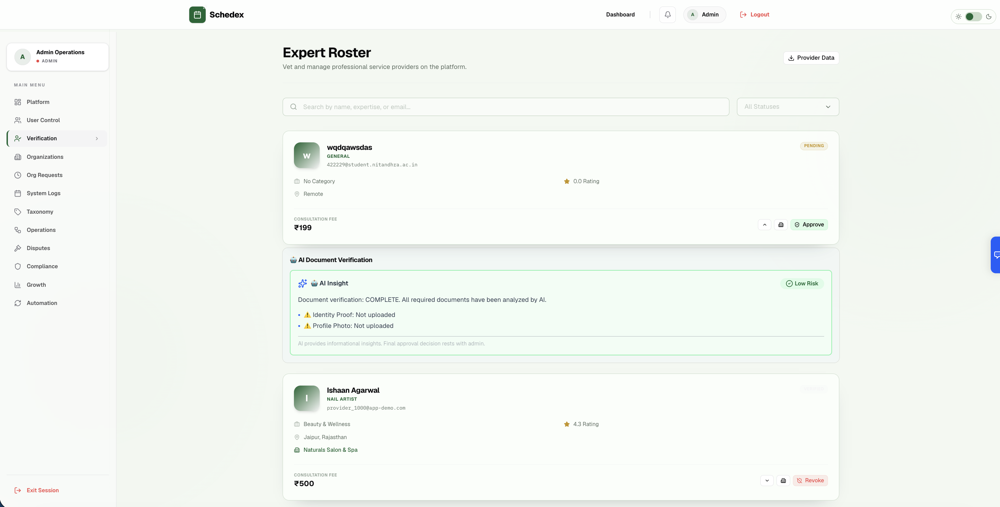

---

### Admin — User Management
- 👥 **All Users View** — Monitor all registered customer, provider, and organization accounts
- 🔐 **Status Control** — Activate or deactivate user accounts from the admin panel
- 🔍 **Search & Filter** — Real-time search with multi-field filtering

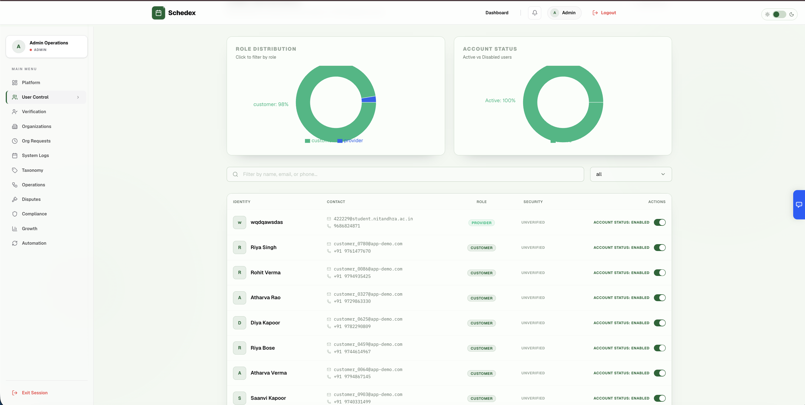

---

### Admin — Appointment Management
- 📦 **Full Overview** — View all appointments across the platform with status badges
- 🔍 **Search, Filter & Sort** — Real-time search paired with multi-field filtering and column sorting
- 📊 **Status Distribution** — Visual breakdown of pending, confirmed, completed, and cancelled appointments

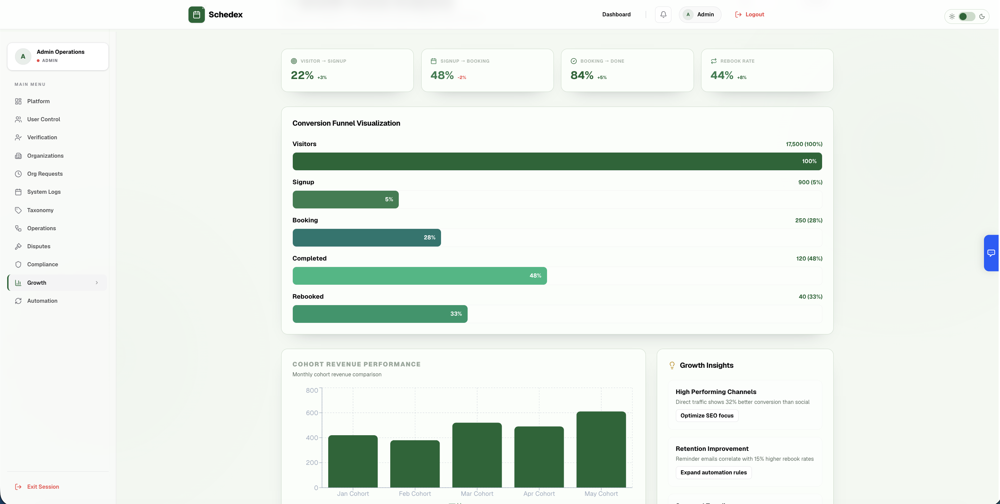

---

### Admin — Category Management
- 🏷️ **Full CRUD** — Create, read, update, and delete service categories
- 📋 **Category Table** — Live list of all categories with provider count

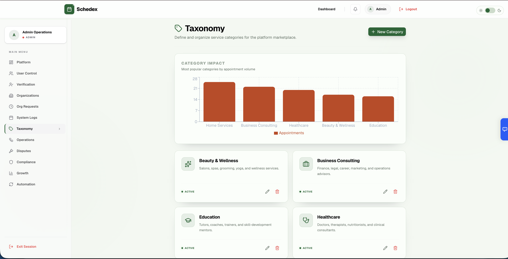

---

### Admin — Organization Management
- 🏢 **Organization Overview** — View all registered organizations and their providers
- 📝 **Creation Requests** — Review and approve organization creation requests
- 👥 **Join Requests** — Manage provider-to-organization join requests

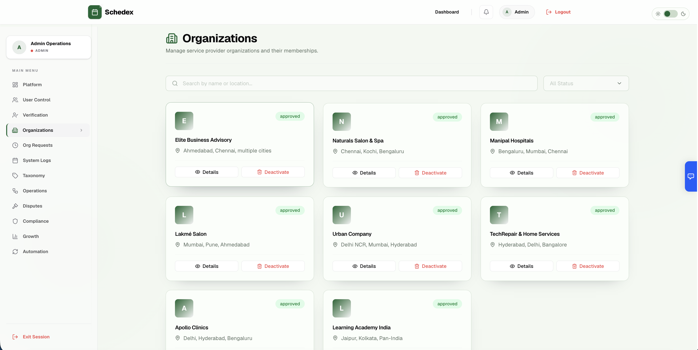

---

### Admin — Operations, Disputes, Compliance, Growth & Automation
- ⚙️ **Operations** — Platform operational metrics and management tools
- ⚖️ **Disputes** — Review and resolve customer-raised disputes
- 📋 **Compliance** — Provider compliance monitoring
- 📈 **Growth** — Platform growth analytics
- 🤖 **Automation** — Automated platform workflows

---

### Customer — Dashboard
- 📊 **Personal Dashboard** — Upcoming appointments, provider recommendations, and quick actions
- 🔔 **Notifications** — Real-time appointment status updates and reminders

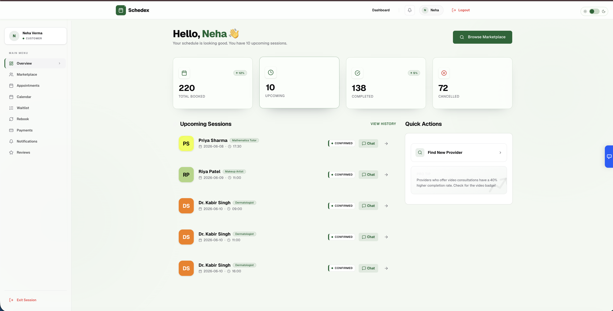

---

### Customer — Provider Discovery & Booking
- 🔍 **Provider Search** — Browse and search service providers by category, location, rating, and availability
- 👤 **Provider Detail** — View provider profile, specialization, experience, reviews, and consultation fee
- 📅 **Slot Selection** — View real-time available slots and select appointment date/time
- ➕ **Book Appointment** — Guided, validated booking form with service selection
- 📋 **Waitlist** — Join waitlist when no slots are available; get notified when a slot opens
- 💳 **Razorpay Payment** — Secure in-app payment via Razorpay checkout modal

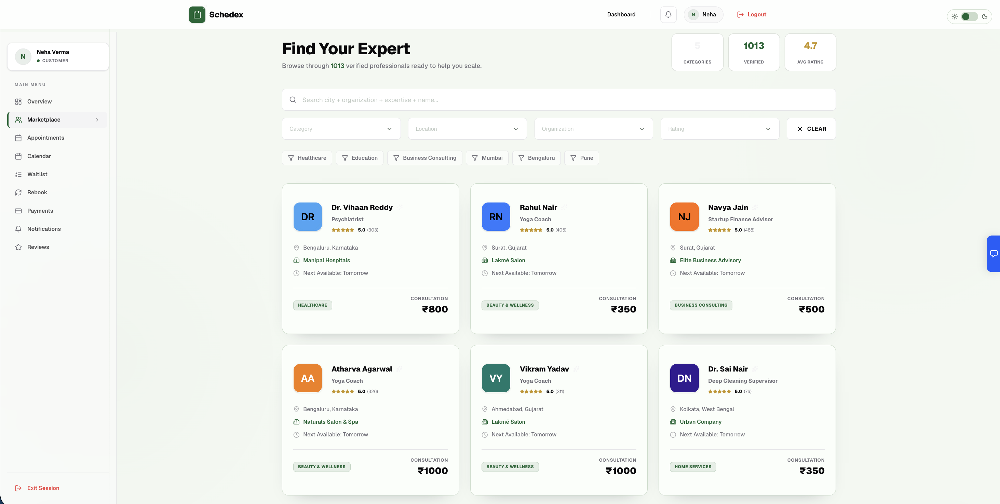

---

### Customer — Appointment Management
- 📜 **Appointment History** — Full chronological record of all past and upcoming appointments
- 📅 **Calendar View** — Visual calendar display of all appointments
- ❌ **Cancellation** — Cancel with penalty preview (late cancellation / no-show fees)
- 🔄 **Reschedule** — Request reschedule with proposal → accept/reject workflow
- ⭐ **Reviews** — Submit ratings and reviews after completed appointments
- 🔁 **Rebook** — Quick rebook with the same provider

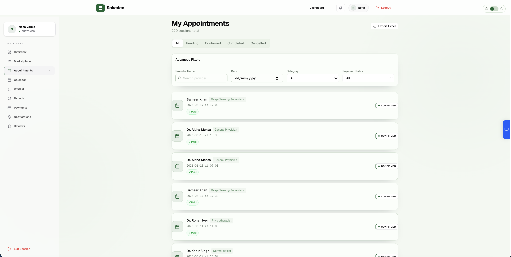

---

### Service Provider — Onboarding
- 📝 **Guided Onboarding** — Step-by-step form with document uploads (certificates, identity proof, profile photo)
- 📄 **Document Upload** — PDF/DOC/DOCX file uploads stored server-side
- 🏷️ **Category Selection** — Choose specialization category during onboarding
- 🏢 **Organization Association** — Optionally join an existing organization

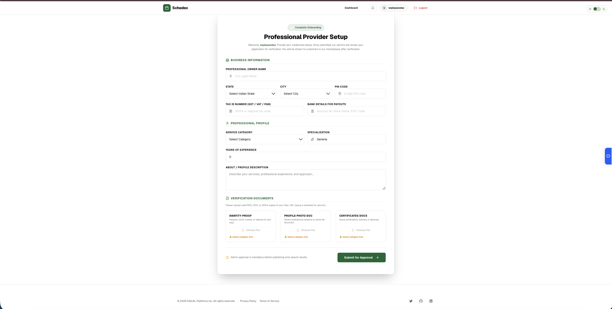

---

### Service Provider — Dashboard & Profile
- 📈 **Provider Dashboard** — Revenue metrics, appointment stats, and upcoming schedule
- 👤 **Profile Management** — Update specialization, experience, description, consultation fee, and photo
- ⭐ **Reviews & Ratings** — View all customer reviews and average rating

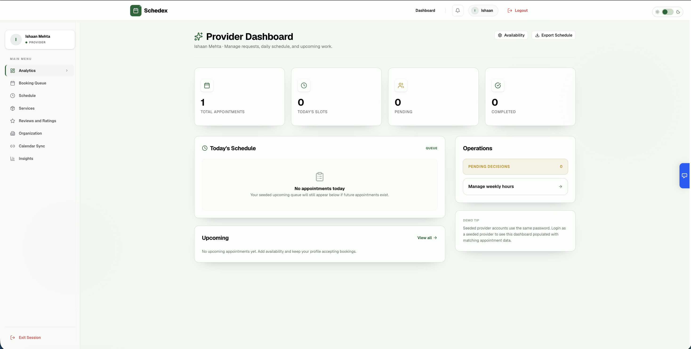

---

### Service Provider — Availability & Appointments
- 📅 **Availability Management** — Full CRUD for weekly availability slots (day, start time, end time)
- 📋 **Appointment List** — View and manage all incoming appointments
- ✅ **Status Updates** — Confirm, complete, or cancel appointments
- 🔄 **Reschedule Requests** — Propose or respond to reschedule requests
- 🏪 **Service Offerings** — Define and manage service packages with pricing
- 📝 **Intake Forms** — Custom intake forms for patient/client information

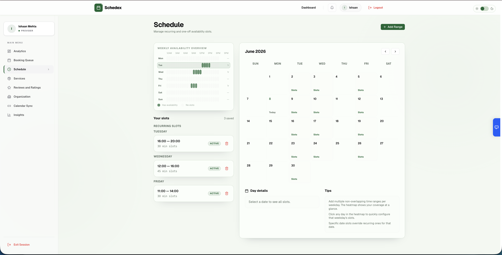

---

### Service Provider — Google Calendar Sync
- 🔗 **Connect Google Calendar** — OAuth-based bidirectional calendar sync
- 📅 **Auto-Sync** — Appointments automatically reflected in Google Calendar
- ❌ **Disconnect** — Remove calendar connection anytime

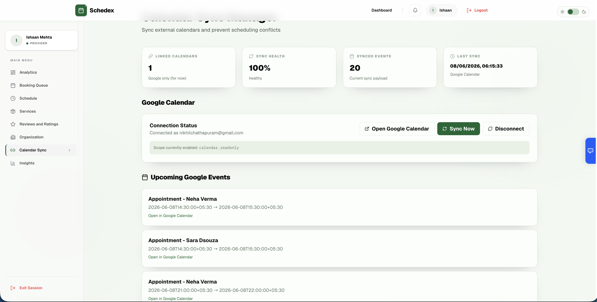

---

### Service Provider — Organization & Team
- 🏢 **Organization View** — See organization membership and details
- 👥 **Team Management** — View team members within the same organization
- 📊 **Insights** — Revenue analytics and appointment trends

---

### Organization — Dashboard
- 🏢 **Organization Dashboard** — Overview of all providers, appointments, and revenue
- 👥 **Employee Management** — View and manage all providers in the organization
- 📝 **Join Requests** — Approve or reject provider join requests
- 📊 **Revenue Tracking** — Organization-wide revenue metrics

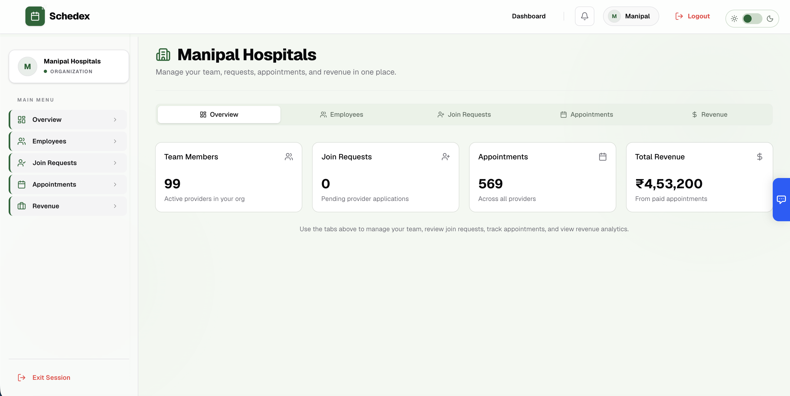

---

### AI-Powered Chatbot — Schedully (RAG Pipeline)
- 🤖 **Context-Aware Chat** — Full RAG pipeline: Planner → Hybrid Retriever (FAISS + BM25) → Reranker → Verifier → Generator
- 📄 **Document Ingestion** — Upload PDF, DOCX, XLSX, MD, TXT (up to 20MB) into personal knowledge base
- 🔍 **Hybrid Retrieval** — FAISS vector search + BM25 keyword search with fusion reranking
- 🔧 **Live API Tools** — Real-time data retrieval for appointments, providers, and schedules
- 🧠 **Session Memory** — Conversation history persistence across sessions
- 🔒 **Tenant Isolation** — Per-user vector corpus isolation
- 🛡️ **Prompt Injection Detection** — Security against adversarial inputs
- 📑 **Certificate Auto-Ingestion** — Provider certificates automatically ingested into their RAG corpus

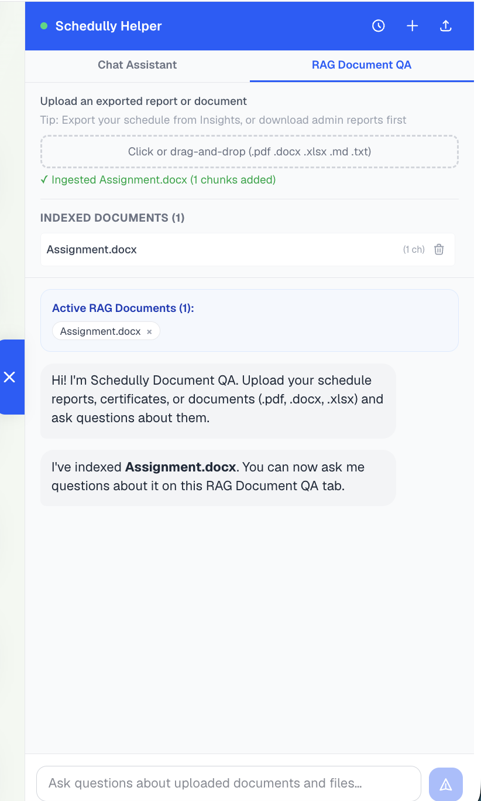

---

### Payment System (Razorpay)
- 💳 **Order Creation** — Backend creates Razorpay payment order; returns `order_id` to frontend
- 💰 **Client Payment** — Frontend renders Razorpay checkout modal
- ✅ **HMAC Signature Verification** — Payment success verified cryptographically on backend
- 📊 **Commission System** — Platform takes 10% commission on each transaction
- 💸 **Scheduled Payouts** — Provider payout processed 1 hour after appointment completion
- 🔄 **Refund Records** — Full refund tracking for cancelled appointments
- ⚠️ **Penalty Fees** — Late cancellation and no-show penalty enforcement

---

### Excel Report Generation (Node.js Microservice)
- 📊 **Admin Reports** — Export appointments, users, and providers as Excel files
- 📅 **Provider Schedule** — Monthly schedule export for providers
- 📜 **Customer History** — Appointment history export for customers
- 🔐 **Internal Auth** — Protected by shared secret header (inter-service communication)

---

## 🛠️ Tech Stack

### Frontend
| Technology | Version | Purpose |
|------------|---------|---------|
| **React** | 19 | Component-based UI library |
| **Redux Toolkit** | ^2.11 | Centralized global state management |
| **React Router DOM** | ^7.13 | Client-side navigation with protected routes |
| **Axios** | ^1.13 | HTTP client — unified frontend API service layer |
| **Recharts** | ^3.8 | Analytics charts for dashboards |
| **Radix UI / Lucide React** | Latest | Accessible component primitives and icons |
| **Shadcn** | ^4.8 | Pre-built UI component library |
| **TailwindCSS** | ^4.2 | Utility-first CSS framework |
| **Vite** | ^8.0 | Build tool and development server |
| **React Day Picker** | ^10.0 | Date selection for appointments |
| **@react-oauth/google** | ^0.13 | Google OAuth frontend integration |

### Backend (Python / FastAPI)
| Technology | Version | Purpose |
|------------|---------|---------|
| **FastAPI** | ≥0.115 | Async REST API framework |
| **SQLAlchemy** | ≥2.0 | ORM for MySQL database |
| **PyMySQL** | ≥1.1 | MySQL driver |
| **Pydantic** | ≥2.10 | Request/response validation |
| **python-jose** | ≥3.3 | JWT token encoding/decoding |
| **passlib + bcrypt** | Latest | Password hashing |
| **FastAPI-Mail** | ≥1.4 | OTP and transactional email |
| **SlowAPI** | ≥0.1.9 | API rate limiting |
| **Redis** | ≥5.0 | Caching layer |
| **Razorpay** | ≥1.4 | Payment gateway SDK |
| **Groq SDK** | Latest | LLM inference for AI document verification |
| **sentence-transformers** | ≥2.7 | Embeddings for RAG chatbot |
| **FAISS** | ≥1.7 | Vector similarity search |
| **httpx** | ≥0.28 | Async HTTP client for inter-service calls |

### Report Service (Node.js / Express)
| Technology | Version | Purpose |
|------------|---------|---------|
| **Express** | ^5.2 | HTTP server for report generation |
| **mysql2** | ^3.20 | MySQL connection for data extraction |
| **xlsx** | ^0.18 | Excel file generation |

### Testing
| Technology | Purpose |
|------------|---------|
| **Playwright** | End-to-end browser testing with role-based fixtures |

---

## 🚀 Setup Instructions

### Prerequisites
- Python 3.10+
- Node.js 18+
- MySQL 8+
- Redis 6+
- Razorpay account
- Groq API key
- Google OAuth credentials
- Gmail account (for OTP emails)

### 1. Clone the Repository
```bash
git clone <repo-url>
cd appointment-scheduling-platform
```

### 2. Set Up the Python Backend
```bash
cd backend
python -m venv venv
source venv/bin/activate      # On Windows: venv\Scripts\activate
pip install -r requirements.txt
```

Create a `.env` file inside `/backend`:
```env
PORT=5000

# MySQL
SQL_DB_NAME=appointment_scheduling
SQL_DB_USER=root
SQL_PASSWORD=your_mysql_password
SQL_HOST=localhost
SQL_PORT=3306

# JWT
JWT_SECRET=your_jwt_secret
JWT_EXPIRES_IN=1

# Email (Gmail SMTP)
EMAIL_USER=your_email@gmail.com
EMAIL_PASS=your_app_password

# Google OAuth
GOOGLE_CLIENT_ID=your_google_client_id
GOOGLE_CLIENT_SECRET=your_google_client_secret
GOOGLE_CALLBACK_URL=http://localhost:5000/auth/google/callback

# Razorpay
RAZORPAY_KEY_ID=your_razorpay_key_id
RAZORPAY_KEY_SECRET=your_razorpay_key_secret

# Microservices
REPORT_SERVICE_URL=http://localhost:4000
REPORT_SERVICE_SECRET=internal_shared_secret_key

# Redis
REDIS_URL=redis://localhost:6379

# MongoDB (for audit logs)
MONGO_URI=mongodb://localhost:27017
MONGO_DB_NAME=sigslot

# AI / Chatbot
GROQ_API_KEY=your_groq_api_key
GEMINI_API_KEY=your_gemini_api_key

# Platform
PLATFORM_COMMISSION_RATE=0.10
PLATFORM_BASE_URL=http://localhost:5000
FRONTEND_URL=http://localhost:5173
```

Start the backend:
```bash
uvicorn main:app --reload --port 5000
```

### 3. Set Up the Report Service (Node.js)
```bash
cd report-service
npm install
```

Create a `.env` file inside `/report-service`:
```env
PORT=4000
REPORT_SERVICE_SECRET=internal_shared_secret_key

# MySQL (same DB as backend)
SQL_HOST=localhost
SQL_USER=root
SQL_PASSWORD=your_mysql_password
SQL_DB=appointment_scheduling
```

Start the report service:
```bash
npm start
```

### 4. Set Up the React Frontend
```bash
cd frontend
npm install
npm run dev
```

### 5. Open your browser
```
http://localhost:5173
```

---

## 📁 Project Structure

```
appointment-scheduling-platform/
│
├── backend/                                # Python / FastAPI primary API
│   ├── main.py                            # FastAPI app entry point
│   ├── requirements.txt                   # Python dependencies
│   ├── config/
│   │   ├── settings.py                    # Pydantic Settings (env config)
│   │   └── database.py                    # SQLAlchemy engine & session
│   ├── routers/
│   │   ├── auth.py                        # Signup, login, OTP, Google OAuth, profile
│   │   ├── customer.py                    # Provider browsing, booking, waitlist
│   │   ├── provider.py                    # Provider profile, appointments, services
│   │   ├── provider_approval.py           # Admin provider approval workflow
│   │   ├── availability.py                # Availability slot CRUD
│   │   ├── admin.py                       # Admin dashboard, user/provider management
│   │   ├── categories.py                  # Service category CRUD
│   │   ├── organization.py                # Organization management
│   │   ├── payments.py                    # Razorpay order creation & verification
│   │   ├── notifications.py              # Notification system
│   │   ├── reports.py                     # Report generation proxy
│   │   ├── disputes.py                    # Dispute management
│   │   └── ai_insights.py                # AI document verification
│   ├── models/
│   │   ├── __init__.py                    # Central model registry (25+ models)
│   │   ├── user.py                        # User model (customer/provider/admin/org)
│   │   ├── service_provider.py            # Provider profile, fees, location
│   │   ├── appointment.py                 # Appointment FSM with payment tracking
│   │   ├── organization.py                # Organization & join requests
│   │   ├── availability.py                # Provider availability slots
│   │   ├── provider_onboarding.py         # Onboarding documents
│   │   ├── ai_insight.py                  # AI verification results
│   │   └── ...                            # 15+ additional models
│   ├── services/
│   │   ├── auth_service.py                # Auth business logic
│   │   ├── payment_service.py             # Razorpay payment logic
│   │   ├── payout_service.py              # Provider payout processing
│   │   ├── ai_service.py                  # Groq LLM document validation
│   │   ├── notification_service.py        # Notification dispatch
│   │   └── ...                            # 10+ additional services
│   ├── middleware/
│   │   ├── auth.py                        # JWT authentication dependency
│   │   └── rate_limiter.py                # SlowAPI rate limiting
│   ├── schemas/                           # Pydantic request/response schemas
│   ├── utils/                             # Helper utilities
│   └── uploads/                           # File upload storage
│
├── schedully/                             # RAG Chatbot Microservice (embedded)
│   └── backend/
│       ├── orchestrator.py                # Full RAG pipeline orchestrator
│       ├── router.py                      # FastAPI router (/api/schedully/*)
│       ├── planner.py                     # Intent classification & planning
│       ├── hybrid_retriever.py            # FAISS + BM25 hybrid retrieval
│       ├── reranker.py                    # Fusion reranking
│       ├── verifier.py                    # Answer verification
│       ├── generator.py                   # LLM response generation
│       ├── memory.py                      # Session conversation memory
│       ├── corpus_engineer.py             # Document ingestion pipeline
│       └── tool_layer.py                  # Live API tool calls
│
├── report-service/                        # Node.js Excel Report Microservice
│   ├── app.js                             # Express app with shared-secret auth
│   ├── package.json                       # Node.js dependencies
│   ├── routes/
│   │   └── reportRoutes.js                # Report endpoint definitions
│   └── controllers/
│       └── reportController.js            # Excel generation logic
│
├── frontend/                              # React / Vite SPA
│   ├── package.json                       # Frontend dependencies
│   ├── vite.config.js                     # Vite build configuration
│   └── src/
│       ├── App.jsx                        # Root component with all routes
│       ├── main.jsx                       # React app entry point
│       ├── pages/
│       │   ├── auth/                      # Login, Signup, OTP, Password Reset
│       │   ├── customer/                  # Dashboard, Providers, Booking, History
│       │   ├── provider/                  # Dashboard, Profile, Availability, Appointments
│       │   ├── admin/                     # Dashboard, Users, Providers, Categories
│       │   ├── organization/              # Org Dashboard, Onboarding
│       │   └── shared/                    # Shared pages across roles
│       ├── components/                    # Reusable UI components
│       ├── store/                         # Redux store & slices (auth, appointments, providers)
│       ├── services/                      # Axios API call services
│       └── utils/                         # Frontend utility helpers
│
├── tests/                                 # Playwright E2E tests
├── playwright.config.js                   # Playwright configuration
└── package.json                           # Root package (Playwright devDep)
```

---

## 🔧 API Endpoints

### Auth
- `POST /auth/signup` — Register a new account (customer/provider/organization)
- `POST /auth/login` — Login with email and password
- `POST /auth/google` — Google OAuth login/signup
- `POST /auth/google/complete-signup` — Complete Google signup with role selection
- `POST /auth/verify-otp` — Verify email OTP for account activation
- `POST /auth/verify-otp/admin` — Verify admin 2FA OTP
- `POST /auth/resend-otp` — Resend OTP to email
- `POST /auth/forgot-password` — Trigger password reset OTP
- `POST /auth/reset-password` — Reset password with OTP
- `GET /auth/profile` — Get current user profile
- `PUT /auth/profile` — Update profile
- `POST /auth/logout` — Logout (clear cookie)
- `DELETE /auth/me` — Soft delete account
- `POST /auth/restore` — Restore soft-deleted account
- `POST /auth/upload-onboarding-file` — Upload onboarding documents

### Customer
- `GET /api/customer/providers` — Browse providers with filters
- `GET /api/customer/providers/:id` — Provider detail with services
- `GET /api/customer/providers/:id/slots` — Available slots for a date
- `POST /api/customer/appointments` — Book an appointment
- `GET /api/customer/appointments` — Get all my appointments
- `GET /api/customer/appointments/:id` — Appointment detail
- `PATCH /api/customer/appointments/:id/cancel` — Cancel appointment
- `PATCH /api/customer/appointments/:id/reschedule` — Request reschedule
- `GET /api/customer/waitlist` — Get my waitlist entries
- `POST /api/customer/providers/:id/waitlist` — Join waitlist
- `GET /api/customer/dashboard` — Dashboard stats
- `POST /api/customer/appointments/:id/review` — Submit review

### Provider
- `GET /api/provider/profile` — Get provider profile
- `PATCH /api/provider/profile` — Update provider profile
- `GET /api/provider/appointments` — Get provider's appointments
- `PATCH /api/provider/appointments/:id/status` — Update appointment status
- `GET /api/provider/dashboard` — Provider dashboard stats
- `GET /api/provider/offerings` — Get service offerings
- `POST /api/provider/offerings` — Create service offering
- `GET /api/provider/calendar/google/connect` — Get Google Calendar OAuth URL
- `POST /api/provider/calendar/google/sync` — Sync calendar

### Availability
- `GET /api/availability` — Get provider's availability slots
- `POST /api/availability` — Create availability slot
- `PATCH /api/availability/:id` — Update slot
- `DELETE /api/availability/:id` — Delete slot

### Admin
- `GET /api/admin/dashboard` — Platform-wide statistics
- `GET /api/admin/users` — All users with filters
- `PATCH /api/admin/users/:id/status` — Activate/deactivate user
- `GET /api/admin/providers` — All providers with filters
- `PATCH /api/admin/providers/:id/verify` — Approve/reject provider
- `GET /api/admin/appointments` — All appointments

### Categories
- `GET /api/categories` — List all categories
- `POST /api/categories` — Create category
- `PATCH /api/categories/:id` — Update category
- `DELETE /api/categories/:id` — Delete category

### Organizations
- `GET /api/organizations` — List organizations
- `POST /api/organizations/request-creation` — Request org creation
- `POST /api/organizations/:id/request-join` — Request to join org
- `GET /api/organizations/org-dashboard/*` — Org dashboard endpoints

### Payments
- `POST /api/payments/create-order` — Create Razorpay payment order
- `POST /api/payments/verify` — Verify Razorpay payment signature
- `POST /api/payments/process-payouts` — Process scheduled provider payouts
- `GET /api/payments/pending-payouts` — List pending payouts
- `GET /api/payments/payout-history` — Payout history

### Notifications
- `GET /api/notifications` — Get user notifications
- `PATCH /api/notifications/:id/read` — Mark as read
- `DELETE /api/notifications/:id` — Delete notification

### Disputes
- `GET /api/disputes` — List disputes
- `POST /api/disputes` — Raise a dispute
- `POST /api/disputes/:id/resolve` — Resolve dispute (admin)

### AI Insights
- `POST /api/provider/analyze-onboarding-documents` — Trigger AI document analysis
- `GET /api/admin/ai-insights/:onboardingId` — Get AI verification results

### Schedully Chatbot
- `POST /api/schedully/chat` — Send message to RAG chatbot
- `POST /api/schedully/ingest` — Upload document to knowledge base
- `GET /api/schedully/sessions` — List chat sessions
- `GET /api/schedully/history` — Get conversation history
- `GET /api/schedully/kb/list` — List ingested documents
- `DELETE /api/schedully/kb/doc/:id` — Delete document from KB

### Report Service (Port 4000)
- `GET /reports/admin/appointments` — Admin appointments Excel export
- `GET /reports/admin/users` — Admin users Excel export
- `GET /reports/admin/providers` — Admin providers Excel export
- `GET /reports/provider/:id/schedule` — Provider monthly schedule export
- `GET /reports/customer/:id/history` — Customer history export

---

## 🎨 Features in Detail

### RAG Chatbot — Schedully
The Schedully chatbot is a fully embedded RAG (Retrieval-Augmented Generation) system:
- **Pipeline**: Query → Planner (intent classification) → Hybrid Retriever (FAISS + BM25) → Reranker (fusion scoring) → Verifier (hallucination check) → Generator (LLM response)
- **Document Ingestion**: PDF, DOCX, XLSX, MD, TXT files chunked and embedded via `sentence-transformers`
- **Live API Tools**: For real-time data (appointments, providers, slots), the planner dispatches tool calls instead of retrieval
- **Prompt Injection Detection**: Classifies adversarial inputs before processing
- **Tenant Isolation**: Each user gets their own vector corpus — no cross-user leakage
- **Two Modes**: "normal" (shared KB + live tools) and "rag" (user-uploaded document Q&A)

### AI Document Verification
- **Groq LLM** (Llama 3) analyzes uploaded PDFs/DOCXs for credential validity
- **Category-Specific Rules**: Healthcare providers need MBBS/MD/license; Beauty needs cosmetology certs; etc.
- **Three-Document Check**: Profile photo (must be image), Identity proof (Aadhaar/Passport/DL), Certificates (degree/license)
- **Risk Scoring**: Low (all docs valid), Medium (partial), High (missing critical docs)
- **Admin Panel**: AI-generated summary + highlights + risk level displayed during provider review

### Razorpay Payment Flow
1. **Order Creation** — Backend calls Razorpay API to create a payment order; returns `order_id` + key
2. **Client Payment** — Frontend renders Razorpay checkout modal using the `order_id`
3. **Signature Verification** — HMAC signature verification before marking appointment as paid
4. **Commission Split** — Platform takes 10% commission; 90% queued for provider payout
5. **Scheduled Payout** — Payout processed 1 hour after appointment time (cron or manual trigger)
6. **Penalty System** — Late cancellation and no-show penalties deducted from refund

### Waitlist System
- Customers join a waitlist when no slots are available for a provider
- When a slot opens (cancellation/reschedule), waitlisted customers are notified
- **Lock Window**: A waitlisted customer gets a time-limited lock to claim the slot
- **Auto-Expiry**: Unclaimed locks expire and pass to the next customer in queue

### Reschedule Request Workflow
1. Customer or Provider proposes a new date/time
2. Other party receives notification and can accept or reject
3. Accepted → appointment date/time updated; rejected → original remains
4. Proposals auto-expire after a timeout (background task runs every 10 minutes)

### Role-Based Access Control
- **Frontend Route Guards** — `ProtectedRoute` and `RoleRoute` components prevent unauthorized rendering
- **JWT Middleware (`auth.py`)** — Verifies JWT from Bearer header or httpOnly cookie; expired tokens rejected with 401
- **Role Dependency (`require_role`)** — Checks decoded role against route requirements; wrong role returns 403
- **Four Roles**: `customer`, `provider`, `admin`, `organization` — each with isolated route trees

---

## 👥 Team

| Member | Responsibilities |
|--------|-----------------|
| **[Team Member 1]** | Project architecture, FastAPI backend, authentication system, RBAC middleware |
| **[Team Member 2]** | Admin dashboard, provider approval workflow, AI document verification |
| **[Team Member 3]** | Schedully RAG chatbot, FAISS retrieval, document ingestion pipeline |
| **[Team Member 4]** | Customer booking flow, Razorpay payment integration, waitlist system |
| **[Team Member 5]** | Provider portal, availability management, Google Calendar sync |
| **[Team Member 6]** | Organization management, disputes, notification system |
| **[Team Member 7]** | Report service (Node.js), Excel generation, E2E Playwright tests |

---

## 🔮 Future Enhancements

- [ ] Real-time appointment status updates via WebSockets
- [ ] SMS notifications via Twilio for appointment reminders
- [ ] Video consultation integration (Zoom/Google Meet)
- [ ] Mobile application for customers and providers (React Native)
- [ ] Multi-language support (i18n)
- [ ] Advanced analytics with trend graphs and heatmaps
- [ ] Docker + Kubernetes containerization for all microservices
- [ ] Provider calendar optimization with AI-suggested slot allocation
- [ ] Multi-currency and international timezone support

## 🐛 Known Issues

- None at this time

---

**Built with ❤️ by the Schedex Team — Capstone Project 2026**
