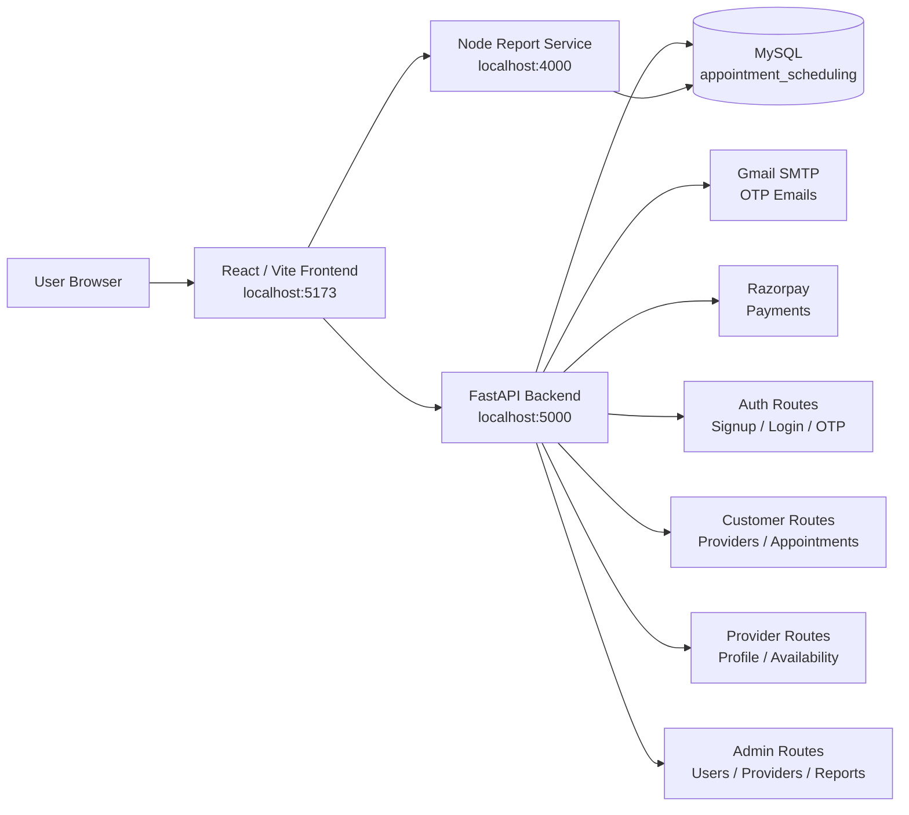

# Sigslot — Appointment Scheduling Platform

A full-stack appointment scheduling platform with a React/Vite frontend, a FastAPI backend, and a separate Node.js report-service for report generation.

---

## Architecture Graph



---

## Startup Commands

Run these in three separate terminal windows from the project root:

```bash
cd /Users/as-mac-1285/Desktop/genai_capstone/appointment-scheduling-platform/backend
source myenv/bin/activate
uvicorn main:app --reload --host 0.0.0.0 --port 5000
```

```bash
cd /Users/as-mac-1285/Desktop/genai_capstone/appointment-scheduling-platform/report-service
npm run dev
```

```bash
cd /Users/as-mac-1285/Desktop/genai_capstone/appointment-scheduling-platform/frontend
npm run dev
```

Open the frontend in your browser:

```text
http://localhost:5173
```

---

## Services

| Service | Folder | Port | Command |
|---------|--------|------|---------|
| Backend API | `backend` | `5000` | `uvicorn main:app --reload --host 0.0.0.0 --port 5000` |
| Report Service | `report-service` | `4000` | `npm run dev` |
| Frontend | `frontend` | `5173` | `npm run dev` |

---

## Demo Seed Data

The customer provider listing only shows providers where `is_verified = true` and `is_accepting_appointments = true`. To populate the app with demo categories, verified providers, and availability slots, run:

```bash
cd /Users/as-mac-1285/Desktop/genai_capstone/appointment-scheduling-platform/backend
source myenv/bin/activate
python -m pip install -r requirements.txt
./myenv/bin/python -c "import sqlalchemy; print(sqlalchemy.__version__)"
./myenv/bin/python seed_demo_data.py --reset-demo
./myenv/bin/python check_seed_visibility.py
```

The seed script validates the database schema first. The `--reset-demo` flag removes only previous demo users, providers, availability slots, and demo appointments before recreating them.

Seeded demo accounts use these credentials:

```text
Admin:
admin@app.local / Admin123

Customers:
neha.verma.customer@app.local / Customer123
aditya.bose.customer@app.local / Customer123
sara.dsouza.customer@app.local / Customer123
rahul.kapoor.customer@app.local / Customer123

Providers:
aisha.mehta.provider@app.local / Provider123
rohan.iyer.provider@app.local / Provider123
kavya.nair.provider@app.local / Provider123
arjun.rao.provider@app.local / Provider123
```

---

## First-Time Setup

### 1. Backend API Dependencies

```bash
cd /Users/as-mac-1285/Desktop/genai_capstone/appointment-scheduling-platform/backend
source myenv/bin/activate
python -m pip install -r requirements.txt
./myenv/bin/python -c "import sqlalchemy; print(sqlalchemy.__version__)"
```

If `myenv` does not exist, create it first:

```bash
cd /Users/as-mac-1285/Desktop/genai_capstone/appointment-scheduling-platform/backend
python3 -m venv myenv
source myenv/bin/activate
python -m pip install -r requirements.txt
```

### 2. Seed Demo Providers

Make sure MySQL is running and `backend/.env` has the correct database values before running the seed command.

```bash
cd /Users/as-mac-1285/Desktop/genai_capstone/appointment-scheduling-platform/backend
source myenv/bin/activate
./myenv/bin/python seed_demo_data.py --reset-demo
./myenv/bin/python check_seed_visibility.py
```

The command should print:

```text
Schema validation passed.
Previous demo users, providers, slots, and demo appointments were reset.
Seeded 5 categories and 10 verified providers.
Seeded 4 customers, 1 admin, and 8 demo appointments.
Demo provider password for all seeded providers: Provider123
Demo customer password for all seeded customers: Customer123
Demo admin login: admin@app.local / Admin123
```

The visibility check should show `customer-visible=10`. If it does, the database contains providers that the customer provider listing API is allowed to return.

### 3. Start Backend API

```bash
cd /Users/as-mac-1285/Desktop/genai_capstone/appointment-scheduling-platform/backend
source myenv/bin/activate
uvicorn main:app --reload --host 0.0.0.0 --port 5000
```

Backend health check:

```text
http://localhost:5000/
```

### 4. Report Service

```bash
cd /Users/as-mac-1285/Desktop/genai_capstone/appointment-scheduling-platform/report-service
npm install
npm run dev
```

The report service runs on:

```text
http://localhost:4000
```

### 5. Frontend

```bash
cd /Users/as-mac-1285/Desktop/genai_capstone/appointment-scheduling-platform/frontend
npm install
npm run dev
```

The frontend runs on:

```text
http://localhost:5173
```

---

## Environment Files

Expected local environment files:

```text
backend/.env
report-service/.env
frontend/.env
```

Important frontend values:

```env
VITE_API_BASE_URL=http://localhost:5000
VITE_REPORT_SERVICE_URL=http://localhost:4000
```

Important backend values:

```env
PORT=5000
FRONTEND_URL=http://localhost:5173
REPORT_SERVICE_URL=http://localhost:4000
REDIS_URL=redis://localhost:6379/0
```

If Redis is not running locally, leave `REDIS_URL` blank and the backend will fall back to in-memory rate limiting:

```env
REDIS_URL=
```

---

## Project Structure

```text
appointment-scheduling-platform/
├── backend/               # FastAPI backend API
│   ├── main.py            # Backend entry point
│   ├── requirements.txt   # Python dependencies
│   ├── routers/           # API route modules
│   ├── services/          # Business logic
│   ├── models/            # SQLAlchemy models
│   ├── schemas/           # Pydantic schemas
│   └── config/            # Settings and database config
│
├── report-service/        # Node.js report generation service
│   ├── app.js             # Report-service entry point
│   ├── package.json       # Node dependencies and scripts
│   ├── routes/            # Report routes
│   ├── controllers/       # Report controllers
│   └── services/          # Report business logic
│
└── frontend/              # React / Vite frontend
    ├── index.html
    ├── vite.config.js
    ├── package.json
    └── src/
        ├── App.jsx
        ├── main.jsx
        ├── pages/
        ├── components/
        ├── services/
        └── store/
```

---

## Notes

- Start the backend before using signup/login from the frontend.
- Start the report-service before using report download/export features.
- The backend API used by the frontend is the FastAPI app in `backend/main.py`.
- If Vite starts on a different port, update `frontend/.env` or `backend/.env` as needed.
