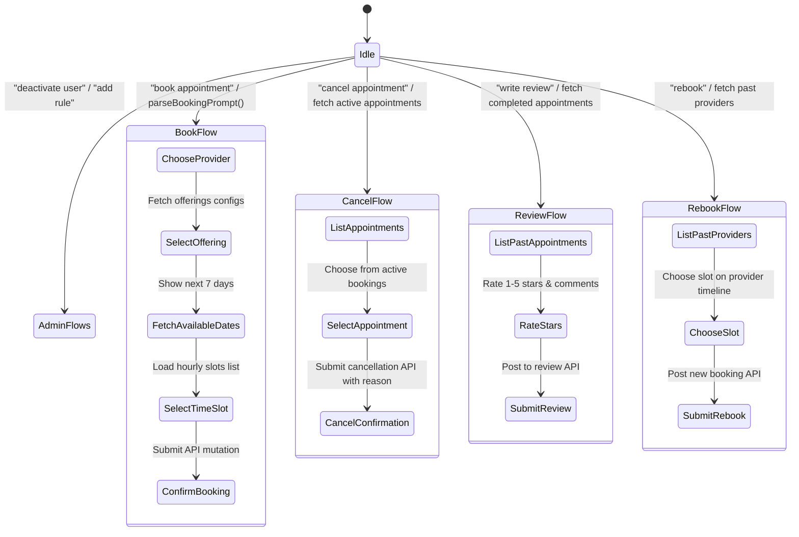

# Schedully Automation & Document Verification

This document details the exact technical implementation, state machine routing, natural language parsing, and document credential validation rules used in Schedully's automated frontend wizard flows and backend document verification system.

---

## 1. Frontend Wizard Automation (`SchedullyChatWidget.jsx`)
The chat widget contains a structured state machine (`currentFlow`) allowing users to execute transactions through interactive wizard forms directly inside the chat interface.

### Natural Language Parser (`parseBookingPrompt`)
Before starting the booking flow, the widget parses the user's message using regex and keyword rules to extract entities and pre-populate the wizard:
- **Category/Specialization**: Matches keywords against a dictionary of 50+ professions (e.g., `"dentist"` $\rightarrow$ Healthcare, `"makeup"` $\rightarrow$ Beauty & Wellness) to extract the category ID.
- **Location**: Maps common cities and regions, standardizing inputs (e.g., `"bangalore"` $\rightarrow$ `"Bengaluru"`, `"telangana"` $\rightarrow$ `"Hyderabad"`, `"tamil nadu"` $\rightarrow$ `"Chennai"`).
- **Date Values**: Resolves relative words (`"today"`, `"tomorrow"`) and absolute calendar notations (e.g., `"15th of June"`, `"June 15"`) into `YYYY-MM-DD` strings.
- **Preferred Time Slots**: Matches formats like `13:30`, `4pm` (converts to `16:00`), or `9 am` (converts to `09:00`).
- **Provider Names**: Matches words following indicators such as `"with"`, `"book"`, `"for"`, or `"to"`, filtering out query stop words (e.g., `"doctor"`, `"specialist"`, `"booking"`).
- **Service Offerings**: Identifies service types (e.g., `"extended session"`, `"intro call"`, `"standard session"`).

---

## 2. Automated Wizard Workflows

### Flow 1: Booking (`book`)
1. **Metadata Loading**: Resolves provider profiles matching the parsed location, category, minimum rating, and search string.
2. **Offering Selection**: Queries the chosen provider's specific session offerings (e.g., standard consult vs. extended treatment).
3. **Date Resolution**: Displays a sliding date-picker for the next 7 days.
4. **Hourly Slots**: Queries `GET /api/customer/providers/{provider_id}/slots?date=YYYY-MM-DD` to load real-time availability.
5. **Confirmation**: Submits `POST /api/customer/appointments` with notes and handles payment status updates.

### Flow 2: Cancellation (`cancel`)
1. **Appointment Fetching**: Queries `GET /api/customer/appointments` for `pending` or `confirmed` status.
2. **Selection**: Renders the active bookings as selectable cards, excluding any entries that have already been cancelled.
3. **Execution**: Submits `PUT /api/customer/appointments/{appointment_id}/cancel` along with the user's notes.

### Flow 3: Reviews (`review`)
1. **History Fetching**: Queries the customer's completed appointment list.
2. **Input Collection**: Renders a star selector (1-5) and comment input box.
3. **Execution**: Submits a POST request to `/api/customer/reviews` linking the provider ID and rating.

### Flow 4: Rebooking (`rebook`)
1. **Past Providers**: Scans the user's historical appointments to identify unique provider IDs.
2. **Fast Booking**: Allows the user to select one of these providers, pick a slot, and submit a new booking request in a single step.

---

## 3. Backend Document Verification Engine (`ai_insights.py`)
Providers completing onboarding must upload three files which are analyzed automatically to verify qualifications:
1. **Profile Photo**: Confirmed to be an image format (JPEG, PNG, GIF) by analyzing file headers (e.g., `\x89PNG` or `\xff\xd8\xff`).
2. **Identity Proof**: Validated against strict government document verification rules.
3. **Certificates**: Validated against educational and category requirements.

### Text Extraction Pipeline
The file's binary content is processed depending on the file type:
- **PDFs**: Text is extracted using `pdfplumber`.
- **DOCX**: XML contents are parsed for paragraphs and tables using `docx` parsers.
- **Images**: OCR is performed using `pytesseract` to extract text from photo documents.
- **Plain Text**: Read directly via standard UTF-8 decoding.

### Strict Rule-Based Identity Validation (`_strict_identity_check`)
To prevent onboarding with invalid IDs, the document text must satisfy type-specific requirements:
- **Aadhaar**: Requires **4/4** conditions:
  1. Keywords `"aadhaar"`, `"aadhar"`, or `"uidai"`.
  2. 12-digit number pattern matching `\d{4}[\s\-]?\d{4}[\s\-]?\d{4}`.
  3. A capitalized full name.
  4. Date or Year of Birth.
- **Driving License**: Requires **4/4** conditions:
  1. Keywords `"driving licence"`, `"dl no"`, or `"transport department"`.
  2. Format matching `[A-Z]{2}[-]?\d{2}[-]?\d{7}`.
  3. Full Name.
  4. Date of Birth.
- **Passports**: Requires matching Passport number format `[A-Z]{1}\d{7}` and Nationality checks.

### Strict Category-Aware Certificate Validation (`_strict_certificate_check`)
Verifies that certificates match the provider's selected onboarding category:
- **Category Keywords**:
  - `Healthcare`: MBBS, MD, MS, BDS, Surgeon, Doctor, License, NMC, MCI.
  - `Beauty & Wellness`: Beautician, Cosmetology, Esthetician, Hair Styling, Makeup Artist.
  - `Business Consulting`: CPA, ICAI, Advocate, MBA, Tax, Accountant.
  - `Education`: Teacher, Lecturer, Professor, B.Ed, degree, etc.
- **Cross-Category Rejection**: If a provider selects the "Healthcare" category but uploads a "Beauty & Wellness" certificate, the verification engine detects the mismatch and automatically rejects the document with a descriptive error message.
